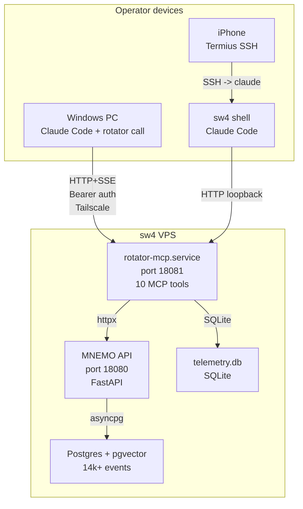
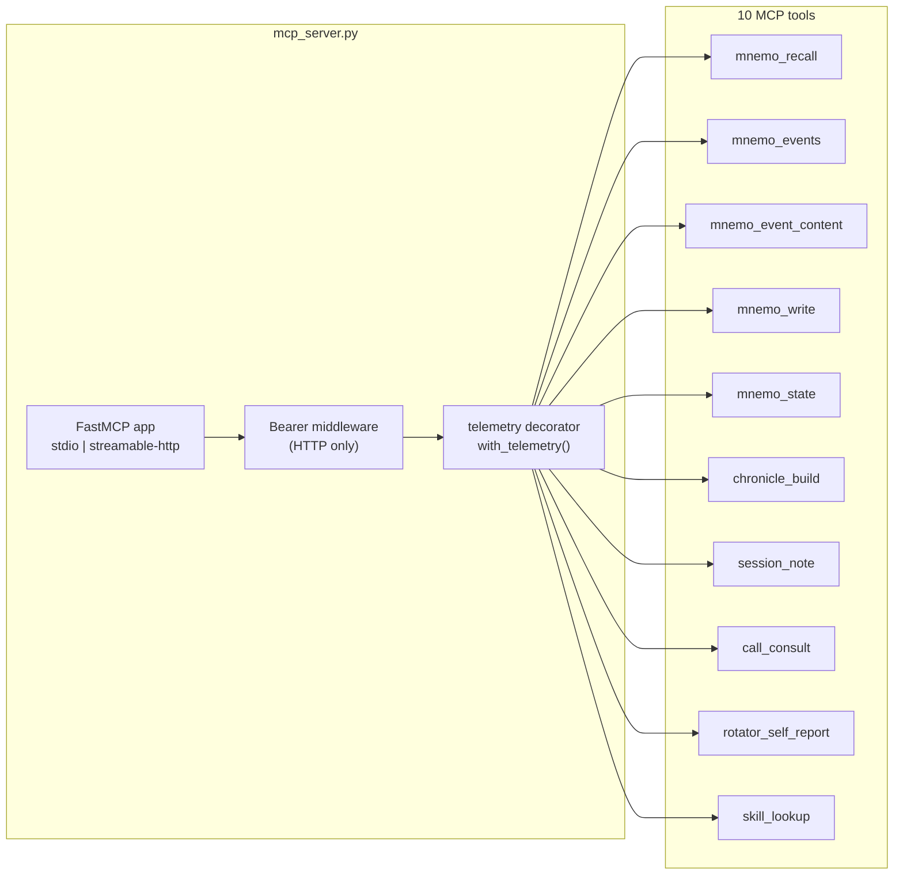
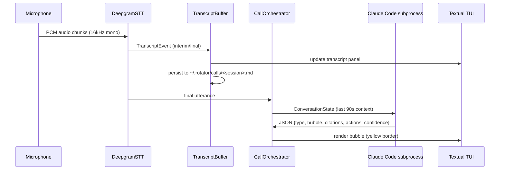
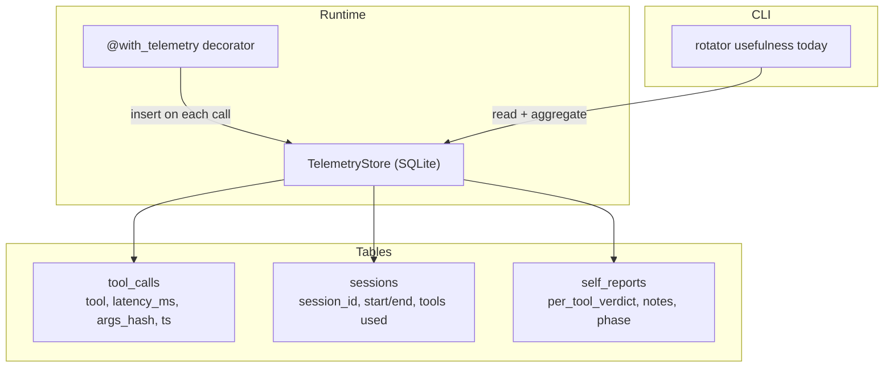

# Rotator -- Architecture

> Curated diagrams from the private repo. Full architecture doc has 5 Mermaid
> diagrams and transport/storage tables; this file shows the 4 most relevant.

## High-level topology

How operator devices connect to the rotator MCP server and MNEMO backend.
All traffic flows over Tailscale; no public internet exposure.

## MCP server internals

The server wraps FastMCP with Bearer auth middleware and a telemetry decorator
that records every tool call to SQLite before the result propagates.

## Voice co-pilot data flow

The `rotator call` command captures mic audio, streams to Deepgram STT,
buffers transcript, and dispatches final utterances to Claude Code subprocess
for structured response.

## Telemetry subsystem

Every tool call is timed by the `@with_telemetry` decorator. Claude self-reports
tool usefulness at session end. The `waste` signal is the most valuable --
it drives prompt and routing improvements.

