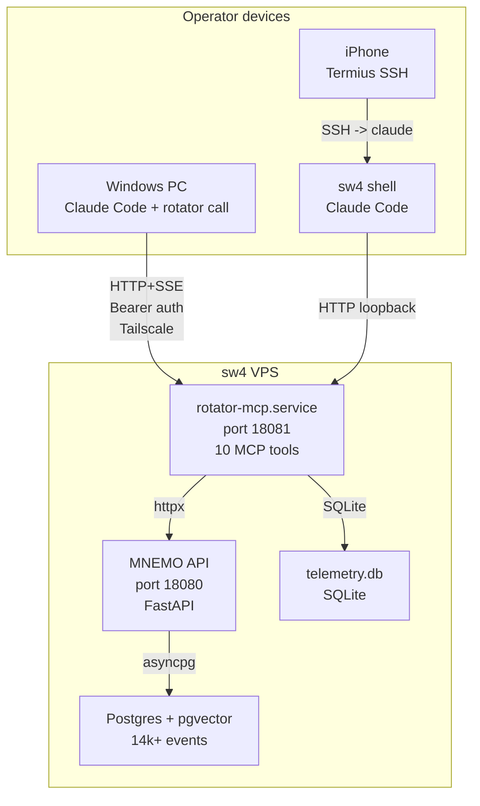

# Rotator

**Voice-first MCP peripheral that gives Claude Code long-term memory, voice input, and self-improvement telemetry.**

Built in 5 days. 262 tests. 10 MCP tools. ~3300 LOC. Single operator. No OpenAI anywhere.

---

## Problem

Claude Code is stateless between sessions. It forgets decisions, loses context,
and cannot real-time listen to your voice. Every new conversation starts from zero --
you re-explain the same project map, re-search for the same events, re-establish
the same constraints.

If you run Claude Code across multiple devices (laptop, VPS, phone-via-SSH),
the fragmentation compounds: each host is an island with no shared memory.

## Solution

Rotator is an MCP server that plugs into Claude Code and gives it:

- **Persistent memory** -- semantic recall, temporal queries, and event writes
  against a Postgres+pgvector store (MNEMO) holding 14,000+ events.
- **Hierarchical chronicles** -- daily/weekly/monthly narrative summaries built
  from raw events and posted back to MNEMO.
- **Voice co-pilot** (`rotator call`) -- mic to STT to transcript to Claude,
  with a Textual TUI showing live transcript and structured responses.
- **Self-telemetry** -- every tool call is timed and logged to SQLite; Claude
  self-reports tool usefulness at session end; `rotator usefulness today`
  surfaces the data.
- **Session notes** -- append-only markdown per conversation, persisted locally.
- **Skill library** -- extract, evaluate, and sync reusable skills to MNEMO.

Single tenant. Single Anthropic Max 5x subscription. Claude Code IS the agent --
rotator is the peripheral that extends it.

## Architecture

Every device wires Claude Code to the same Tailscale-fronted URL. No local
Python needed on client devices -- one `claude mcp add --transport http` and
all 10 tools are available.

## Key decision: ADR-2026-05-20 -- the inversion

After 6 days of building Rotator as a classifier+squads orchestrator that
spawned Claude Code as a subprocess for "execute_code" tasks, I diagnosed the
design as backwards. The orchestrator was re-implementing 1/10th of what Claude
Code already does natively -- planning, multi-step tool composition, conversation
memory, file reading, shell access, browser control.

The fix was to invert the relationship entirely. Instead of rotator containing
an LLM loop that spawns Claude Code, Claude Code became the brain and rotator
became its peripheral. The classifier died, the squads died, the bounded loop
died. What survived: the MCP server exposing memory, voice, and telemetry as
tools that Claude Code calls at will.

This is the strongest architectural signal in the project: recognizing when your
own abstraction is worse than the platform you are building on, and having the
discipline to throw it away. The full ADR is in
[docs/adr-claude-code-is-the-brain.md](docs/adr-claude-code-is-the-brain.md).

## MCP tools (10)

| Tool | Purpose |
|------|---------|
| `mnemo_recall` | Semantic search (cosine x time-decay x salience) |
| `mnemo_events` | Temporal event listing by date range, project, type |
| `mnemo_event_content` | Full transcript/body of a single event |
| `mnemo_write` | POST a new event to MNEMO |
| `mnemo_state` | Health check and event counts |
| `chronicle_build` | Build daily/weekly/monthly chronicle, POST to MNEMO |
| `session_note` | Append free-form note to session file |
| `call_consult` | Voice co-pilot brain -- dispatch to Claude subprocess |
| `rotator_self_report` | Claude self-reports tool usefulness at session end |
| `skill_lookup` | Search skills in MNEMO |

## Module overview

| Module | Role |
|--------|------|
| `mcp_server.py` | 10 MCP tools, stdio + HTTP transport, Bearer auth middleware |
| `call/` | Voice co-pilot: audio capture, STT stream, transcript, orchestrator |
| `call/prompts/` | 5-layer composable system prompt for call_consult |
| `telemetry/` | SQLite store for tool call timing, self-reports, usefulness CLI |
| `memory/` | MNEMO client, conversation buffer, session notes |
| `chronicler.py` | Hierarchical chronicle builder (daily/weekly/monthly) |
| `voice/` | Mic, STT (Deepgram), TTS (Silero/Edge), interrupt detection |
| `skills/` | Skill extraction, evaluation, MNEMO sync |

## Numbers (2026-05-24)

| Metric | Value |
|--------|-------|
| MCP tools | 10 |
| Unit tests | 262, all passing |
| Python LOC | ~3,300 (76 modules in `src/rotator/`) |
| MNEMO events | 14,000+ |
| Build time | 5 days (D0-scaffold to D7-release, then 3 days voice+telemetry) |
| Transports | stdio (local) + streamable-HTTP (remote, Bearer auth) |

## Samples

Code excerpts from the private repo, provided for review:

| File | What it shows |
|------|---------------|
| [`samples/mcp_server.py`](samples/mcp_server.py) | 10-tool MCP server with telemetry hooks and Bearer auth |
| [`samples/call/consult.py`](samples/call/consult.py) | Shared brain dispatch -- prompt build, subprocess, JSON parse |
| [`samples/call/types.py`](samples/call/types.py) | ConversationState type system with rolling window |
| [`samples/call/prompts/system_prompt.py`](samples/call/prompts/system_prompt.py) | 5-layer composable prompt (role/tools/anti-patterns/output/runtime) |
| [`samples/call/transcript.py`](samples/call/transcript.py) | TranscriptBuffer with markdown persistence |
| [`samples/telemetry/middleware.py`](samples/telemetry/middleware.py) | `@with_telemetry` decorator -- fail-soft timing wrapper |
| [`samples/telemetry/store.py`](samples/telemetry/store.py) | SQLite schema + daily aggregates + self-report storage |

## Status (2026-05-24)

| Component | State |
|-----------|-------|
| MNEMO durable memory (sw4) | shipped |
| Hierarchical chronicler | shipped |
| rotator-mcp stdio (10 tools) | shipped |
| rotator-mcp remote HTTP+SSE (Bearer auth, systemd) | shipped |
| Voice co-pilot Phase A (mic + STT + transcript) | shipped |
| Voice co-pilot Phase B (Claude bubble + clarify) | shipped |
| call_consult MCP tool | shipped |
| Telemetry M1 (tool call timing middleware) | shipped |
| Telemetry M2 (self-report + usefulness CLI) | shipped |
| Multi-host wiring (Windows + VPS + iPhone) | live |
| Voice co-pilot Phase C (PyQt6 overlay) | next |
| Voice co-pilot Phase D (intent classifier) | planned |

## Roadmap

- **Phase C** -- PyQt6 transparent always-on-top overlay replacing Textual TUI
- **Phase D** -- Haiku-based intent classifier + correction loop
- **Phase F** -- WASAPI loopback + diarization for live call assistance
- **Metrics M3-M5** -- Client hooks, daily aggregator cron, weekly self-eval

## Hard constraints

- **No OpenAI APIs anywhere.** Anthropic / Deepgram / Groq / Silero / gTTS / Edge only.
- **Single tenant.** No multi-user, no marketplace.
- **Voice as primary input channel.** Text works as fallback.
- **Claude Code is the brain.** Rotator never contains its own LLM orchestration loop.

## See also

- [mnemo-showcase](https://github.com/CreatmanCEO/mnemo-showcase) -- the event
  graph + RAG store that rotator reads from and writes to.

---

Built by Nick (CREATMAN) + Claude (Anthropic) in operator-in-the-loop pairing, May 2026.
